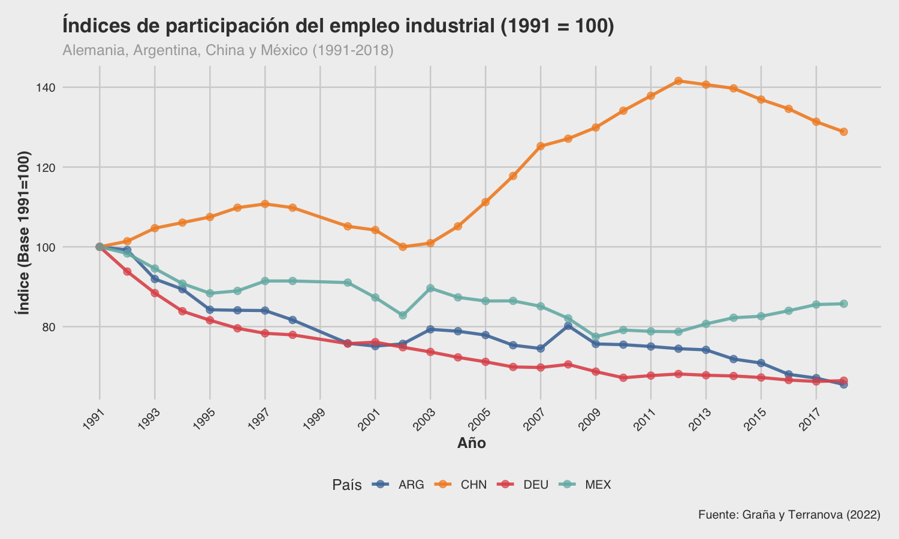
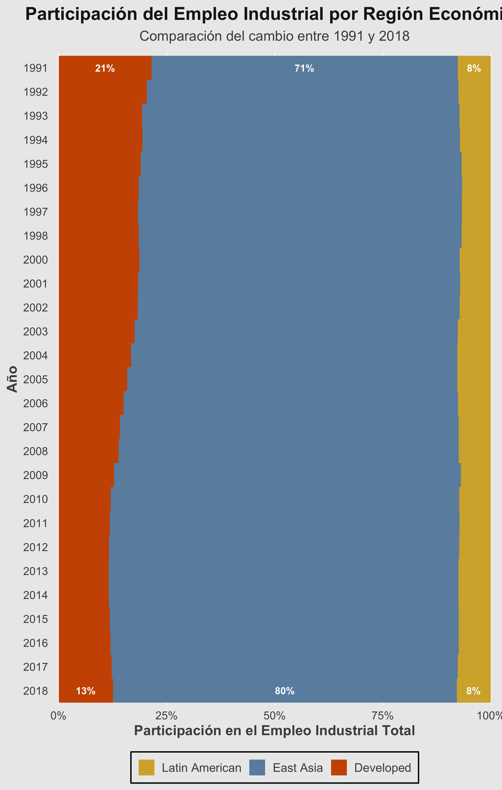

Práctica 1, Módulo 3: Desindustrialización y Empleo Industrial
================
Durga Valentina Linares Herrera

## Introducción

Este documento presenta la resolución de los ejercicios de la Práctica 1
del Módulo 3 de la **Diplomatura PAEEC - UBA**, centrada en el análisis
de la desindustrialización. El análisis se basa en datos del trabajo de
Graña y Terranova (2022).

**Nota Importante:** Para que este código funcione correctamente, el
archivo `empleo_industrial.csv` debe estar guardado en la **misma
carpeta** que este archivo `.Rmd`. Se ha modificado la ruta de carga del
archivo para reflejar esto.

``` r
# Se carga el dataset y se realiza un filtrado y limpieza inicial.
# Este objeto 'datos_empleo_base' servirá para ambos ejercicios.
datos_empleo_base <- read_csv("empleo_industrial.csv") %>%
  select(Anio, País, Regiones.economicas, Ocup_TOTAL_ECONOMIA, Ocup_INDUSTRIA) %>%
  filter(
    Anio >= 1991,
    Anio <= 2018,
    Anio != 1999  # Se remueve el año 1999 por falta de datos.
  ) %>%
  mutate(pp_empleo_industrial = Ocup_INDUSTRIA / Ocup_TOTAL_ECONOMIA)
```

------------------------------------------------------------------------

## Consigna 1: Evolución de la Participación del Empleo Industrial

Se construye un gráfico de líneas para observar la evolución de la
participación del empleo industrial en el empleo total para Alemania,
Argentina, China y México. Se utiliza un número índice con base 1991=100
para facilitar la comparación de las trayectorias relativas.

``` r
# Filtrado y cálculo del índice para los países seleccionados
datos_indice_paises <- datos_empleo_base %>%
  filter(País %in% c("DEU", "ARG", "CHN", "MEX")) %>%
  arrange(País, Anio) %>%
  group_by(País) %>%
  mutate(
    valor_base_1991 = pp_empleo_industrial[Anio == 1991],
    indice = (pp_empleo_industrial / valor_base_1991) * 100
  ) %>%
  ungroup()

# Generación del gráfico de líneas y puntos
ggplot(datos_indice_paises, aes(x = Anio, y = indice, color = País, group = País)) +
  geom_line(linewidth = 1.2, alpha = 0.9) +
  geom_point(size = 2.5, alpha = 0.7) +
  scale_x_continuous(breaks = seq(from = 1991, to = 2018, by = 2)) +
  labs(
    title = "Índices de participación del empleo industrial (1991 = 100)",
    subtitle = "Alemania, Argentina, China y México (1991-2018)",
    x = "Año",
    y = "Índice (Base 1991=100)",
    caption = "Fuente: Graña y Terranova (2022)"
  ) +
  theme_fivethirtyeight() +
  scale_color_tableau() +
  theme(
    legend.position = "bottom",
    plot.title = element_text(face = "bold", size = 16),
    plot.subtitle = element_text(size = 12, color = "darkgrey"),
    axis.title = element_text(face = "bold"),
    panel.grid.minor = element_blank(),
    axis.text.x = element_text(angle = 45, hjust = 1)
  )
```

<!-- -->

### Interpretación del Gráfico 1

*Iustra la evolución de la participación del empleo industrial en el
empleo total para Alemania (DEU), Argentina (ARG), China (CHN) y México
(MEX) durante el período 1991-2018. Se destaca la trayectoria de China,
que experimenta un significativo crecimiento en la importancia de su
empleo industrial, superando a los demás países y marcando un pico
notable antes de una leve moderación. En contraste, Alemania evidencia
una disminución gradual en su participación industrial, mientras que
México y Argentina presentan niveles más bajos y con diferentes
dinámicas a lo largo del período. El caso de China es particular:
representa una excepción y un nuevo paradigma en la dinámica global de
industrialización. Desde finales del siglo XX, su conversión en la
“fábrica del mundo”, impulsada por la atracción de inversión extranjera
y una vasta mano de obra de bajo costo, le permitió desarrollar una
poderosa base manufacturera. Este auge ha sido un factor relevante en
los procesos de desindustrialización observados en otras economías,
tanto avanzadas como en desarrollo, incluyendo América Latina, al
desplazar industrias locales y, en algunos casos, fomentar una
reprimarización de las exportaciones.*

------------------------------------------------------------------------

## Consigna 2: Participación del Empleo Industrial por Regiones

Para esta consigna, se construye un gráfico de barras apiladas que
muestra la participación del empleo industrial de cada región en el
empleo total de todos los países de la muestra para cada año. Las
opciones del chunk (`fig.width=7`, `fig.height=11`) aseguran que el
gráfico se genere en un formato vertical para una mejor visualización.

``` r
# Preparación de datos específica para la consigna 2
datos_regiones <- datos_empleo_base %>%
  filter(!is.na(Regiones.economicas) & !is.na(Ocup_INDUSTRIA)) %>%
  group_by(Anio, Regiones.economicas) %>%
  summarise(Total_Ocup_Industria_Region = sum(Ocup_INDUSTRIA, na.rm = TRUE), .groups = 'drop') %>%
  group_by(Anio) %>%
  mutate(
    Total_Ocup_Industria_Anio_Muestra = sum(Total_Ocup_Industria_Region, na.rm = TRUE),
    Participacion_Region_En_Total_Industria = ifelse(Total_Ocup_Industria_Anio_Muestra > 0,
                                                     Total_Ocup_Industria_Region / Total_Ocup_Industria_Anio_Muestra, 0)
  ) %>%
  ungroup() %>%
  filter(Total_Ocup_Industria_Anio_Muestra > 0)

# Reordenar categorías y calcular posición de etiquetas
datos_para_grafico_2 <- datos_regiones %>%
  mutate(Regiones.economicas = fct_relevel(Regiones.economicas, "Latin American", "East Asia", "Developed")) %>%
  arrange(Anio, desc(Regiones.economicas)) %>%
  group_by(Anio) %>%
  mutate(posicion_label_x = cumsum(Participacion_Region_En_Total_Industria) - 0.5 * Participacion_Region_En_Total_Industria) %>%
  ungroup()

# Definir la paleta de colores final
paleta_final <- c(
  "Developed" = "#CC5500",      # Naranja Quemado
  "East Asia" = "#6A8EAE",      # Azul Acero
  "Latin American" = "#D4AF37"  # Dorado Antiguo
)

# Generación del gráfico de barras apiladas vertical
grafico_definitivo <- ggplot(datos_para_grafico_2, aes(x = Participacion_Region_En_Total_Industria, y = factor(Anio), fill = Regiones.economicas)) +
  geom_col(position = "stack", width = 1) +
  geom_text(data = . %>% filter(Anio == 1991 | Anio == 2018),
            aes(x = posicion_label_x, label = percent(Participacion_Region_En_Total_Industria, accuracy = 1)),
            color = "white", size = 3.5, fontface = "bold") +
  scale_fill_manual(values = paleta_final) +
  scale_x_continuous(labels = percent_format(accuracy = 1L), expand = c(0, 0.01)) +
  scale_y_discrete(limits = rev) +
  labs(title = "Participación del Empleo Industrial por Región Económica",
       subtitle = "Comparación del cambio entre 1991 y 2018",
       x = "Participación en el Empleo Industrial Total", y = "Año", fill = NULL) +
  theme_minimal(base_size = 14) +
  theme(
    plot.background = element_rect(fill = "grey92", color = "grey92"),
    panel.background = element_rect(fill = "grey92", color = "grey92"),
    panel.grid.major = element_line(color = "white", linewidth = 0.5),
    panel.grid.major.y = element_blank(), panel.grid.minor = element_blank(),
    plot.title = element_text(color = "grey10", face = "bold", size = 18, hjust = 0.5),
    plot.subtitle = element_text(color = "grey30", size = 14, hjust = 0.5, margin = margin(b=10)),
    axis.title = element_text(color = "grey30", face = "bold"),
    axis.text = element_text(color = "grey30"),
    axis.text.x = element_text(angle = 0),
    legend.position = "bottom",
    legend.background = element_rect(fill = "grey92"),
    legend.text = element_text(color = "grey30", size = 12),
    legend.key = element_rect(fill = "grey92")
  )

print(grafico_definitivo)
```

<!-- -->

### Interpretación del Gráfico 2

*Representa la participación porcentual de distintas regiones económicas
(Developed, East Asia, Latin American) en el empleo industrial total de
la muestra de países, anualmente desde 1991 hasta 2018. Se observa una
clara transformación: la región “East Asia” incrementa drásticamente su
participación a lo largo del período, convirtiéndose en la principal
contribuyente al empleo industrial de la muestra hacia los años más
recientes. Mientras tanto, la participación de la región “Developed”
disminuye considerablemente, y “Latin American” mantiene una cuota menor
y relativamente estable.*
